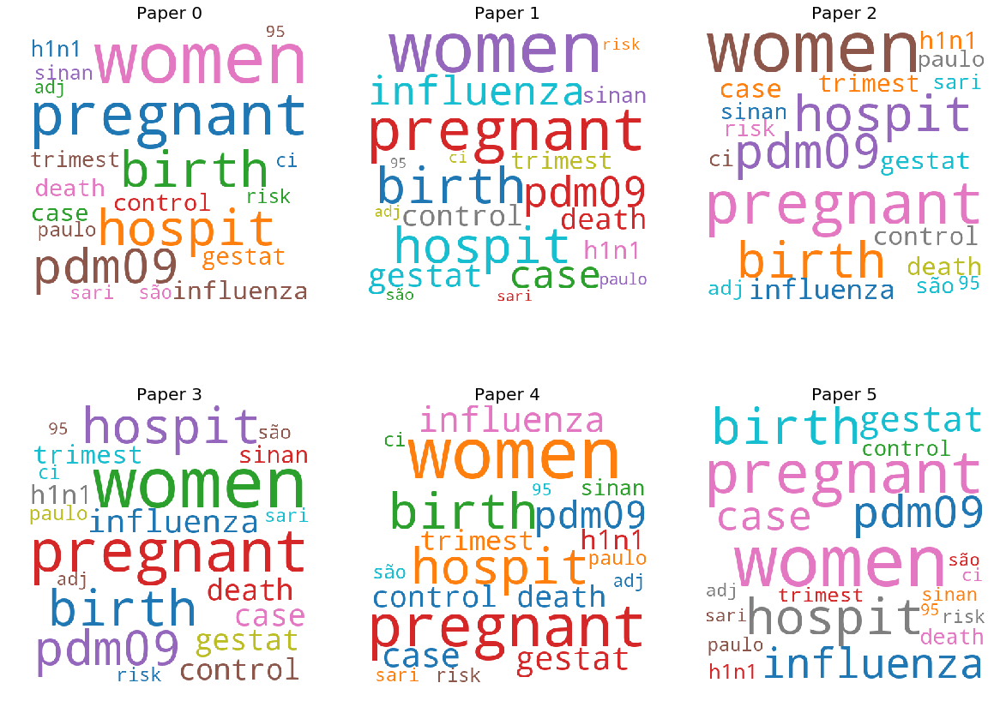

# COVID-19 Open Research Dataset Challenge (CORD-19) using TF-IDF
This repository is my solution to multiple kaggle tasks
* [covid-19 kaggle call for help](https://www.kaggle.com/allen-institute-for-ai/CORD-19-research-challenge/tasks)
* [What is known about transmission, incubation, and environmental stability?](https://www.kaggle.com/allen-institute-for-ai/CORD-19-research-challenge/tasks?taskId=568)
* [What do we know about COVID-19 risk factors?](https://www.kaggle.com/allen-institute-for-ai/CORD-19-research-challenge/tasks?taskId=558)
* [What do we know about virus genetics, origin, and evolution?](https://www.kaggle.com/allen-institute-for-ai/CORD-19-research-challenge/tasks?taskId=567)
* [What do we know about vaccines and therapeutics?](https://www.kaggle.com/allen-institute-for-ai/CORD-19-research-challenge/tasks?taskId=561)
* [What do we know about non-pharmaceutical interventions?](https://www.kaggle.com/allen-institute-for-ai/CORD-19-research-challenge/tasks?taskId=587)
* [What has been published about medical care?](https://www.kaggle.com/allen-institute-for-ai/CORD-19-research-challenge/tasks?taskId=572)
* [What do we know about diagnostics and surveillance?](https://www.kaggle.com/allen-institute-for-ai/CORD-19-research-challenge/tasks?taskId=570)
* [What has been published about information sharing and inter-sectoral collaboration?](https://www.kaggle.com/allen-institute-for-ai/CORD-19-research-challenge/tasks?taskId=583)
* [What has been published about ethical and social science considerations?](https://www.kaggle.com/allen-institute-for-ai/CORD-19-research-challenge/tasks?taskId=563)

## Notebook
[Notebook](covid-19-using-tf-idf.ipynb) consist of 
* loading data
* enriching the metadata.csv with other data in dataset
* proprocessing text data
* applying TF-IDF approach
* results
* search friendly widget

## Dataset Description
In response to the COVID-19 pandemic, the White House and a coalition of leading research groups have prepared the COVID-19 Open Research Dataset (CORD-19). CORD-19 is a resource of over 45,000 scholarly articles, including over 33,000 with full text, about COVID-19, SARS-CoV-2, and related coronaviruses. This freely available dataset is provided to the global research community to apply recent advances in natural language processing and other AI techniques to generate new insights in support of the ongoing fight against this infectious disease. There is a growing urgency for these approaches because of the rapid acceleration in new coronavirus literature, making it difficult for the medical research community to keep up. 

[link to dataset](https://www.kaggle.com/allen-institute-for-ai/CORD-19-research-challenge)

## Approach
The data consist of ~2 GB of text files. I decided to enrich metadata.csv file with all the text that was availiable in dataset and use that as document. Rather than working on papers titles only. As all tasks are using the same dataset and are basically topic modeling tasks, I have put all results to single notebook.

In the end of notebook is implementation of search friendly widget if anyone want to search using other phrase then pre-defined ones from tasks.

## Results
Results for two phazes that were present in dataset

### Smoking, pre-existing pulmonary disease
no. | title | doi | authors 
:--:|:-----:|:---:|:------:
0 |   Losartan attenuates chronic cigarette smoke ex... |	10.1016/j.taap.2010.02.009		 | Han, Su-Xia; He, Guang-Ming; Wang, Tao; Chen, ...
1 |   Legislative smoking bans for reducing harms fr... |	10.1002/14651858.CD005992.pub3 | Frazer, Kate; Callinan, Joanne E; McHugh, Jack...
2 |   Reducing health disparity in Taiwan: quantifyi... |	10.1136/tc.2003.005546	       | Cheng, T; Wen, C; Tsai, S; Chung, W; Hsu, C
3 |   Smoking attributable mortality for Taiwan and ... |	10.1136/tc.2004.007955	       | Wen, C; Tsai, S; Chen, C; Cheng, T; Tsai, M; L...
4 |   Effects of smoking and solid-fuel use on COPD,... |	10.1016/S0140-6736(08)61345-8	 | Lin, Hsien-Ho; Murray, Megan; Cohen, Ted; Coli...
5 |   Role of angiotensin-converting enzyme (ACE) an... |	10.1016/j.burns.2015.04.010	 | Yilin, Zhao; Yandong, Nan; Faguang, Jin


### Neonates and pregnant women
no. | title | doi | authors 
:--:|:-----:|:---:|:------:
0 |	Analysis of the pregnancy outcomes in pregnant... |   10.3760/cma.j.cn112141-20200218-00111 | Zhang, L.; Jiang, Y.; Wei, M.; Cheng, B. H.; Z...
1 |	Severe influenza A(H1N1)pdm09 in pregnant wome... |   10.1371/journal.pone.0194392	        | Ribeiro, Ana Freitas; Pellini, Alessandra Cris...
2 |	Pregnancy and infection: using disease pathoge... |   10.1038/s41541-017-0042-4	           | Vermillion, Meghan S.; Klein, Sabra L.
3 |	Emerging Infections and Pregnancy	              |   10.3201/eid1211.060152	              | Jamieson, Denise J.; Theiler, Regan N.; Rasmus...
4 |	Public Health Approach to Emerging Infections ... |   10.2105/AJPH.2004.054957	           | Rasmussen, Sonja A.; Hayes, Edward B.
5 |	Pandemic Influenza and Pregnant Women: Summary... |   10.2105/AJPH.2008.152900	           | Rasmussen, Sonja A.; Jamieson, Denise J.; MacF...



## Search-friendly widget


## To run the notebook
* Install dependencies
   ```bash
   pip3 install -r requirements.txt
   ```
* Download [covid-19 dataset](https://www.kaggle.com/allen-institute-for-ai/CORD-19-research-challenge) and unpack zip to notebook directory
* you might need to change 'root_dir' variable in one of first cells